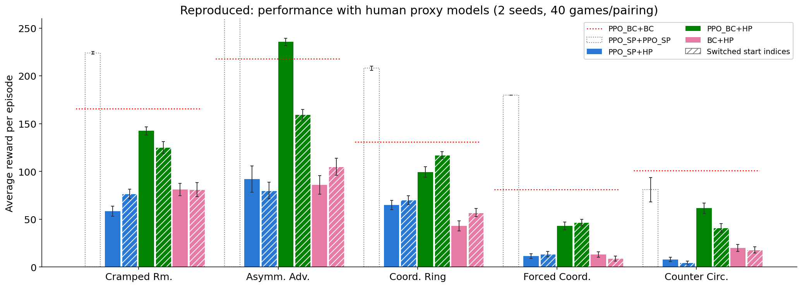
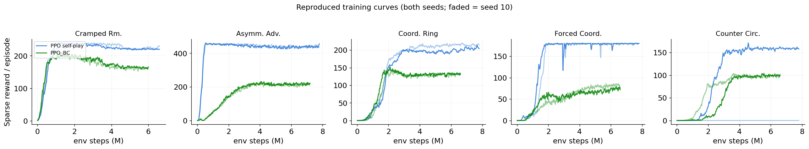

# Reproduced results — self-play PPO vs BC-partnered PPO

Reproduction of the human–AI coordination result from Carroll et al., NeurIPS 2019,
using the compatibility fixes in this branch. Each agent is evaluated against a
**human proxy (HP)** — a behavior-cloning model trained on the *held-out test split*
of the 2019 human–human data, which no agent saw during training.

- 5 layouts × {self-play PPO, BC-partnered PPO} × 2 seeds (0, 10) = 20 training runs
- Hyperparameters from `run_experiments.sh` / `run_ppo_bc_experiments.sh`
- Evaluation: 20 games per pairing, per seat order, per seed (40 games/cell pooled)

## Performance with human proxy models

Mean episode reward (both seeds pooled, order-averaged), ± SEM:

| Layout | PPO_SP pair | PPO_SP + HP | PPO_BC + HP | BC + HP |
|---|---|---|---|---|
| Cramped Room | 224 ± 1 | 68 ± 4 | 134 ± 4 | 81 ± 5 |
| Asymm. Advantages | 436 ± 1 | 86 ± 8 | 198 ± 5 | 96 ± 7 |
| Coordination Ring | 208 ± 2 | 68 ± 3 | 108 ± 3 | 50 ± 4 |
| Forced Coordination | 180 ± 0 | 12 ± 2 | 45 ± 3 | 11 ± 2 |
| Counter Circuit | 81 ± 13 | 6 ± 1 | 51 ± 4 | 19 ± 2 |
| **Mean** | **226** | **48** | **107** | **51** |

## Training curves

## Findings (all consistent with the paper and the repo's `performance.jpg`)

1. **BC-partnered PPO beats self-play PPO with a human proxy on all 5 layouts**
   (mean 107 vs 48, ~2.2×), in both seat orders and both seeds.
2. **Self-play PPO is no better than the plain BC baseline** with a human partner
   (48 vs 51) despite being excellent with itself (226).
3. Coordination collapse concentrates on convention-heavy layouts (Forced
   Coordination, Counter Circuit), where self-play scores fall toward zero.
4. On Counter Circuit, the seed-10 *self-play* run never learned to deliver a
   single soup (exploration collapse — visible as the flat blue curve), while its
   BC-partnered sibling trained normally; the BC partner scaffolds exploration.

`eval_results.json` holds the raw per-seed, per-seat-order game returns.
